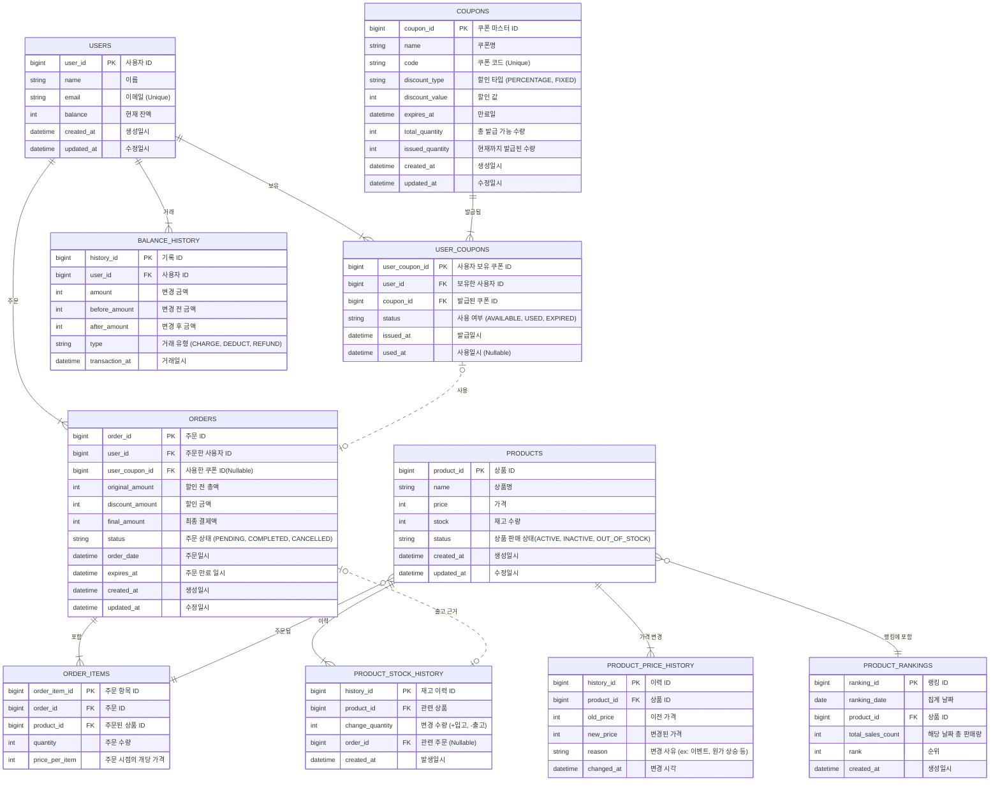

```mermaid
erDiagram
    USERS {
        bigint user_id PK "사용자 ID"
        string name "이름"
        string email "이메일 (Unique)"
        int balance "현재 잔액"
        datetime created_at "생성일시"
        datetime updated_at "수정일시"
    }

    PRODUCTS {
        bigint product_id PK "상품 ID"
        string name "상품명"
        int price "가격"
        int stock "재고 수량"
        string status "상품 판매 상태(ACTIVE, INACTIVE, OUT_OF_STOCK)"
        datetime created_at "생성일시"
        datetime updated_at "수정일시"
    }

    PRODUCT_PRICE_HISTORY {
        bigint history_id PK "이력 ID"
        bigint product_id FK "상품 ID"
        int old_price "이전 가격"
        int new_price "변경된 가격"
        string reason "변경 사유 (ex: 이벤트, 원가 상승 등)"
        datetime changed_at "변경 시각"
    }

    ORDERS {
        bigint order_id PK "주문 ID"
        bigint user_id FK "주문한 사용자 ID"
        bigint user_coupon_id FK "사용한 쿠폰 ID(Nullable)"
        int original_amount "할인 전 총액"
        int discount_amount "할인 금액"
        int final_amount "최종 결제액"
        string status "주문 상태 (PENDING, COMPLETED, CANCELLED)"
        datetime order_date "주문일시"
        datetime expires_at "주문 만료 일시"
        datetime created_at "생성일시"
        datetime updated_at "수정일시"
    }

    ORDER_ITEMS {
        bigint order_item_id PK "주문 항목 ID"
        bigint order_id FK "주문 ID"
        bigint product_id FK "주문된 상품 ID"
        int quantity "주문 수량"
        int price_per_item "주문 시점의 개당 가격"
    }

    PRODUCT_STOCK_HISTORY {
        bigint history_id PK "재고 이력 ID"
        bigint product_id FK "관련 상품"
        int change_quantity "변경 수량 (+입고, -출고)"
        bigint order_id FK "관련 주문 (Nullable)"
        datetime created_at "발생일시"
    }

    COUPONS {
        bigint coupon_id PK "쿠폰 마스터 ID"
        string name "쿠폰명"
        string code "쿠폰 코드 (Unique)"
        string discount_type "할인 타입 (PERCENTAGE, FIXED)"
        int discount_value "할인 값"
        datetime expires_at "만료일"
        int total_quantity "총 발급 가능 수량"
        int issued_quantity "현재까지 발급된 수량"
        datetime created_at "생성일시"
        datetime updated_at "수정일시"
    }

    USER_COUPONS {
        bigint user_coupon_id PK "사용자 보유 쿠폰 ID"
        bigint user_id FK "보유한 사용자 ID"
        bigint coupon_id FK "발급된 쿠폰 ID"
        string status "사용 여부 (AVAILABLE, USED, EXPIRED)"
        datetime issued_at "발급일시"
        datetime used_at "사용일시 (Nullable)"
    }

    BALANCE_HISTORY {
        bigint history_id PK "기록 ID"
        bigint user_id FK "사용자 ID"
        int amount "변경 금액"
        int before_amount "변경 전 금액"
        int after_amount "변경 후 금액"
        string type "거래 유형 (CHARGE, DEDUCT, REFUND)"
        datetime transaction_at "거래일시"
    }
    
    PRODUCT_RANKINGS {
        bigint ranking_id PK "랭킹 ID"
        date ranking_date "집계 날짜"
        bigint product_id FK "상품 ID"
        int total_sales_count "해당 날짜 총 판매량"
        int rank "순위"
        datetime created_at "생성일시"
    }

    USERS ||--|{ ORDERS : "주문"
    USERS ||--|{ USER_COUPONS : "보유"
    USERS ||--|{ BALANCE_HISTORY : "거래"
    
    ORDERS ||--|{ ORDER_ITEMS : "포함"
    PRODUCTS }o--|| ORDER_ITEMS : "주문됨"
    
    COUPONS ||--|{ USER_COUPONS : "발급됨"
    USER_COUPONS |o..o| ORDERS : "사용"

    PRODUCTS ||--|{ PRODUCT_STOCK_HISTORY : "이력"
    PRODUCTS ||--|{ PRODUCT_PRICE_HISTORY : "가격 변경"
    ORDERS |o..o| PRODUCT_STOCK_HISTORY : "출고 근거"

    PRODUCTS }o--|| PRODUCT_RANKINGS : "랭킹에 포함"
```