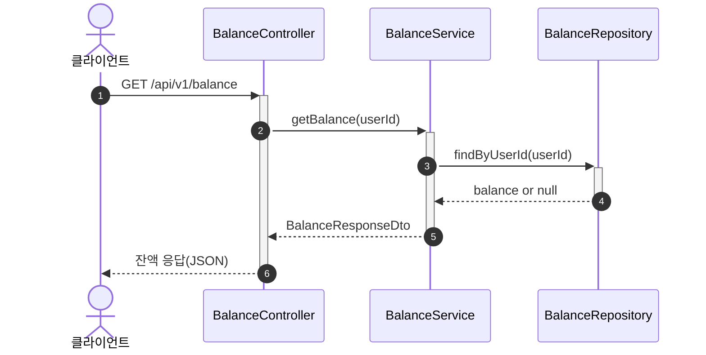
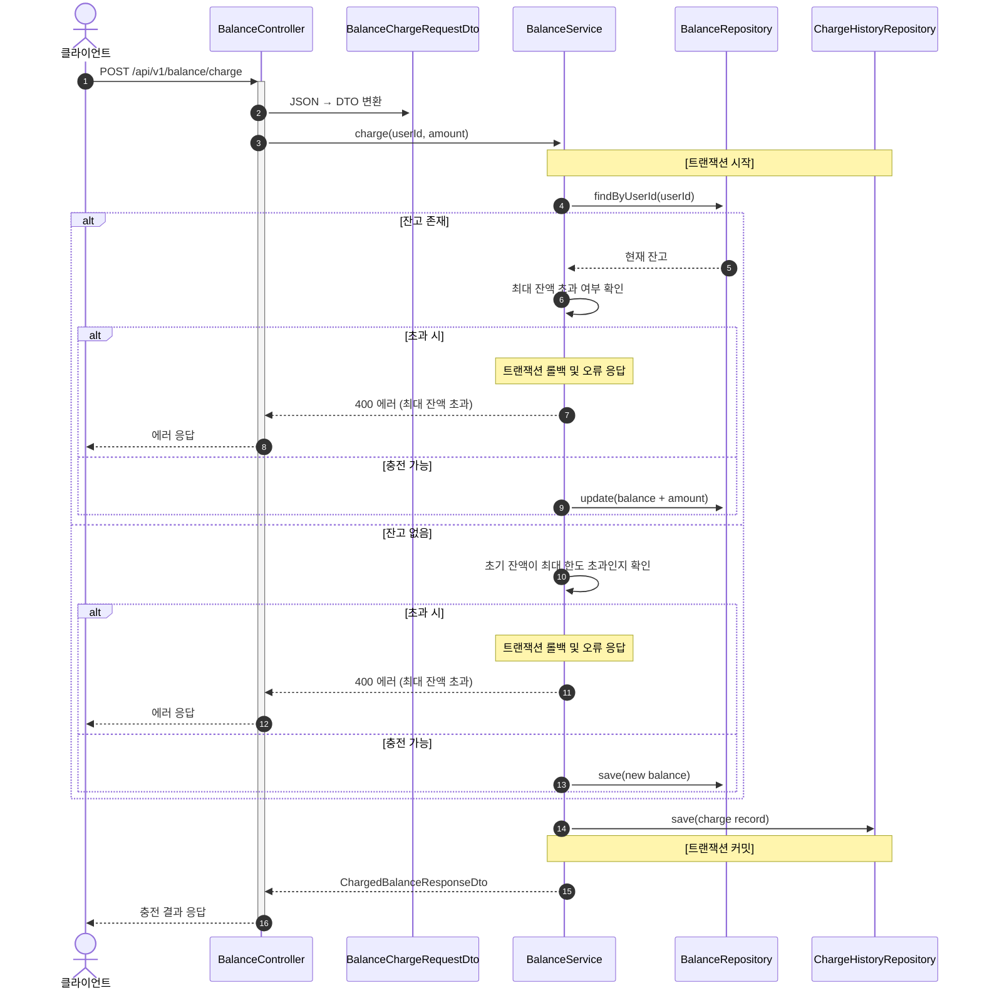
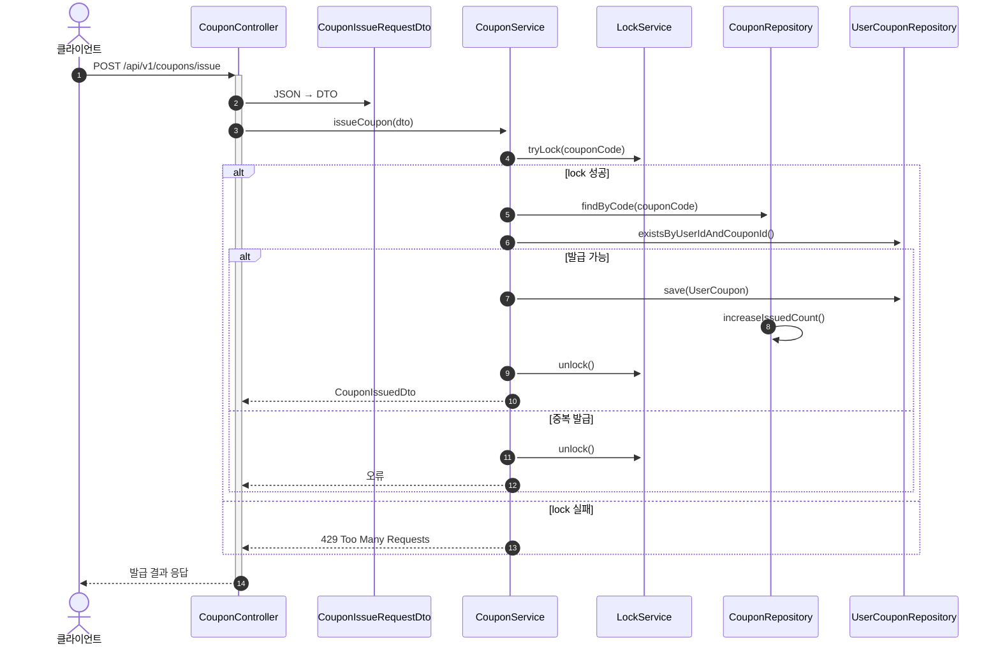
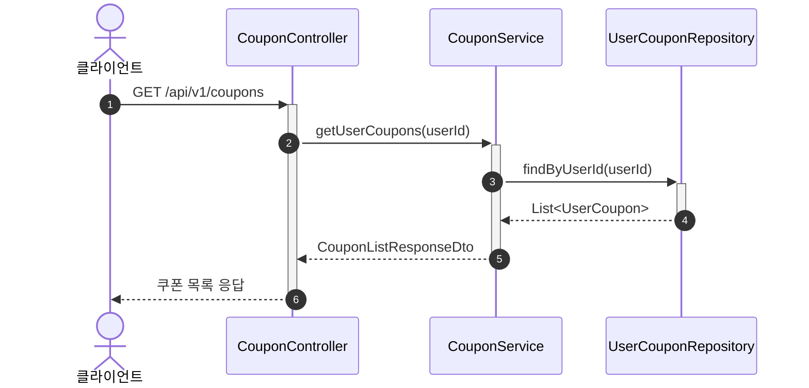
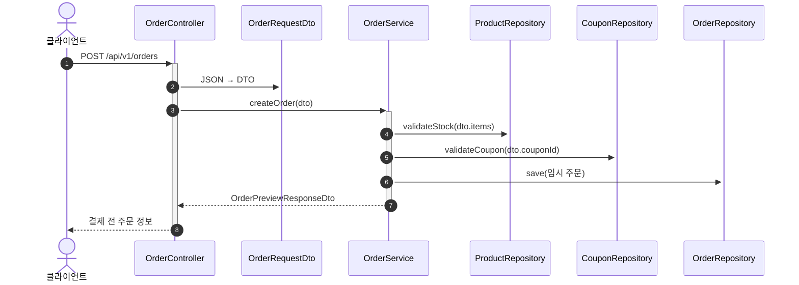
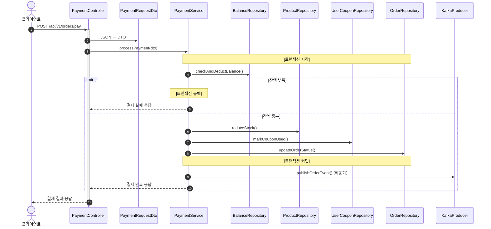
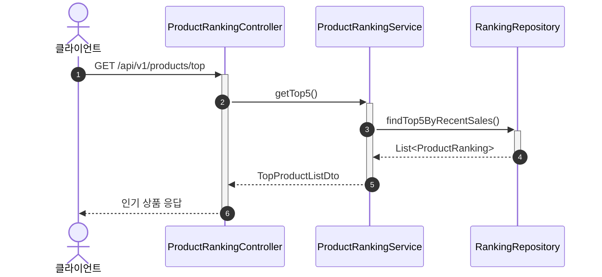
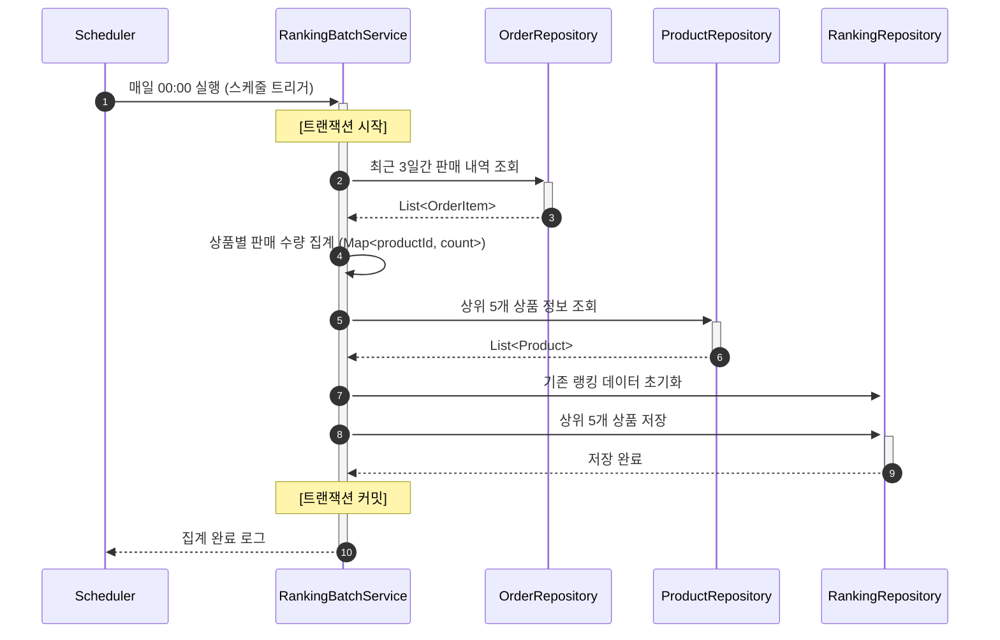

## 잔액 조회

```mermaid
sequenceDiagram
    autonumber
    actor 클라이언트
    participant BalanceController
    participant BalanceService
    participant BalanceRepository

    클라이언트->>+BalanceController: GET /api/v1/balance
    BalanceController->>+BalanceService: getBalance(userId)
    BalanceService->>+BalanceRepository: findByUserId(userId)
    BalanceRepository-->>-BalanceService: balance or null
    BalanceService-->>-BalanceController: BalanceResponseDto
    BalanceController-->>-클라이언트: 잔액 응답(JSON)
```

## 잔액 충전

```mermaid
sequenceDiagram
    autonumber
    actor 클라이언트
    participant BalanceController
    participant BalanceChargeRequestDto
    participant BalanceService
    participant BalanceRepository
    participant ChargeHistoryRepository

    클라이언트->>+BalanceController: POST /api/v1/balance/charge
    BalanceController->>+BalanceChargeRequestDto: JSON → DTO 변환
    BalanceController->>+BalanceService: charge(userId, amount)

    note over BalanceService, ChargeHistoryRepository: [트랜잭션 시작]

    BalanceService->>+BalanceRepository: findByUserId(userId)
    alt 잔고 존재
        BalanceRepository-->>BalanceService: 현재 잔고
        BalanceService->>BalanceService: 최대 잔액 초과 여부 확인
        alt 초과 시
            note over BalanceService: 트랜잭션 롤백 및 오류 응답
            BalanceService-->>BalanceController: 400 에러 (최대 잔액 초과)
            BalanceController-->>클라이언트: 에러 응답
        else 충전 가능
            BalanceService->>BalanceRepository: update(balance + amount)
        end
    else 잔고 없음
        BalanceService->>BalanceService: 초기 잔액이 최대 한도 초과인지 확인
        alt 초과 시
            note over BalanceService: 트랜잭션 롤백 및 오류 응답
            BalanceService-->>BalanceController: 400 에러 (최대 잔액 초과)
            BalanceController-->>클라이언트: 에러 응답
        else 충전 가능
            BalanceService->>BalanceRepository: save(new balance)
        end
    end

    BalanceService->>ChargeHistoryRepository: save(charge record)

    note over BalanceService, ChargeHistoryRepository: [트랜잭션 커밋]

    BalanceService-->>BalanceController: ChargedBalanceResponseDto
    BalanceController-->>-클라이언트: 충전 결과 응답
```

## 쿠폰 발급

```mermaid
sequenceDiagram
    autonumber
    actor 클라이언트
    participant CouponController
    participant CouponIssueRequestDto
    participant CouponService
    participant LockService
    participant CouponRepository
    participant UserCouponRepository

    클라이언트->>+CouponController: POST /api/v1/coupons/issue
    CouponController->>+CouponIssueRequestDto: JSON → DTO
    CouponController->>+CouponService: issueCoupon(dto)

    CouponService->>+LockService: tryLock(couponCode)
    alt lock 성공
        CouponService->>+CouponRepository: findByCode(couponCode)
        CouponService->>+UserCouponRepository: existsByUserIdAndCouponId()
        alt 발급 가능
            CouponService->>UserCouponRepository: save(UserCoupon)
            CouponRepository->>CouponRepository: increaseIssuedCount()
            CouponService->>LockService: unlock()
            CouponService-->>CouponController: CouponIssuedDto
        else 중복 발급
            CouponService->>LockService: unlock()
            CouponService-->>CouponController: 오류
        end
    else lock 실패
        CouponService-->>CouponController: 429 Too Many Requests
    end
    CouponController-->>-클라이언트: 발급 결과 응답
```

## 보유 쿠폰 조회

```mermaid
sequenceDiagram
    autonumber
    actor 클라이언트
    participant CouponController
    participant CouponService
    participant UserCouponRepository

    클라이언트->>+CouponController: GET /api/v1/coupons
    CouponController->>+CouponService: getUserCoupons(userId)
    CouponService->>+UserCouponRepository: findByUserId(userId)
    UserCouponRepository-->>-CouponService: List<UserCoupon>
    CouponService-->>-CouponController: CouponListResponseDto
    CouponController-->>-클라이언트: 쿠폰 목록 응답
```

## 주문 생성

```mermaid
sequenceDiagram
    autonumber
    actor 클라이언트
    participant OrderController
    participant OrderRequestDto
    participant OrderService
    participant ProductRepository
    participant CouponRepository
    participant OrderRepository

    클라이언트->>+OrderController: POST /api/v1/orders
    OrderController->>+OrderRequestDto: JSON → DTO
    OrderController->>+OrderService: createOrder(dto)

    OrderService->>+ProductRepository: validateStock(dto.items)
    OrderService->>+CouponRepository: validateCoupon(dto.couponId)
    OrderService->>+OrderRepository: save(임시 주문)

    OrderService-->>-OrderController: OrderPreviewResponseDto
    OrderController-->>-클라이언트: 결제 전 주문 정보
```

## 결제 처리

```mermaid
sequenceDiagram
    autonumber
    actor 클라이언트
    participant PaymentController
    participant PaymentRequestDto
    participant PaymentService
    participant BalanceRepository
    participant ProductRepository
    participant UserCouponRepository
    participant OrderRepository
    participant KafkaProducer

    클라이언트->>+PaymentController: POST /api/v1/orders/pay
    PaymentController->>+PaymentRequestDto: JSON → DTO
    PaymentController->>+PaymentService: processPayment(dto)

    note over PaymentService, OrderRepository: [트랜잭션 시작]

    PaymentService->>BalanceRepository: checkAndDeductBalance()
    alt 잔액 부족
        note over PaymentService: [트랜잭션 롤백]
        PaymentService-->>PaymentController: 결제 실패 응답
    else 잔액 충분
        PaymentService->>ProductRepository: reduceStock()
        PaymentService->>UserCouponRepository: markCouponUsed()
        PaymentService->>OrderRepository: updateOrderStatus()

        note over PaymentService, OrderRepository: [트랜잭션 커밋]

        PaymentService->>KafkaProducer: publishOrderEvent() (비동기)
        PaymentService-->>PaymentController: 결제 완료 응답
    end
    PaymentController-->>-클라이언트: 결제 결과 응답
```

## 상품 랭킹 조회

```mermaid
sequenceDiagram
    autonumber
    actor 클라이언트
    participant ProductRankingController
    participant ProductRankingService
    participant RankingRepository

    클라이언트->>+ProductRankingController: GET /api/v1/products/top
    ProductRankingController->>+ProductRankingService: getTop5()
    ProductRankingService->>+RankingRepository: findTop5ByRecentSales()
    RankingRepository-->>-ProductRankingService: List<ProductRanking>
    ProductRankingService-->>-ProductRankingController: TopProductListDto
    ProductRankingController-->>-클라이언트: 인기 상품 응답
```

## 상품 랭킹 집계 배치

```mermaid
sequenceDiagram
    autonumber
    participant Scheduler
    participant RankingBatchService
    participant OrderRepository
    participant ProductRepository
    participant RankingRepository

    Scheduler->>+RankingBatchService: 매일 00:00 실행 (스케줄 트리거)

    note over RankingBatchService: [트랜잭션 시작]

    RankingBatchService->>+OrderRepository: 최근 3일간 판매 내역 조회
    OrderRepository-->>-RankingBatchService: List<OrderItem>

    RankingBatchService->>RankingBatchService: 상품별 판매 수량 집계 (Map<productId, count>)

    RankingBatchService->>+ProductRepository: 상위 5개 상품 정보 조회
    ProductRepository-->>-RankingBatchService: List<Product>

    RankingBatchService->>+RankingRepository: 기존 랭킹 데이터 초기화
    RankingBatchService->>+RankingRepository: 상위 5개 상품 저장
    RankingRepository-->>-RankingBatchService: 저장 완료

    note over RankingBatchService: [트랜잭션 커밋]

    RankingBatchService-->>-Scheduler: 집계 완료 로그
```