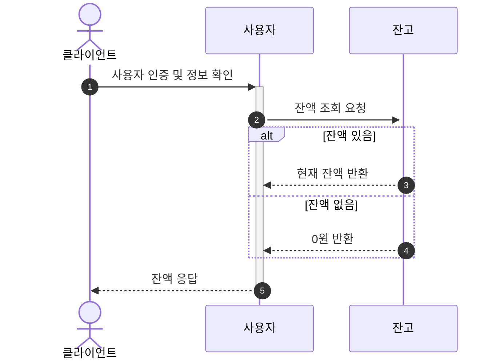
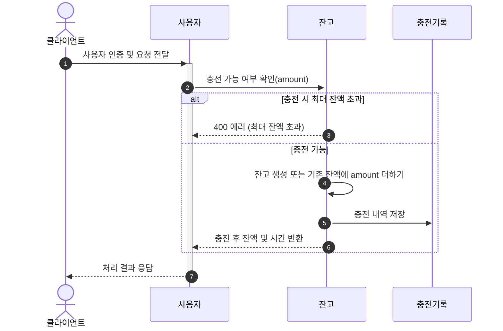
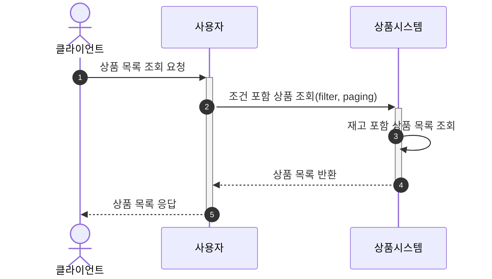
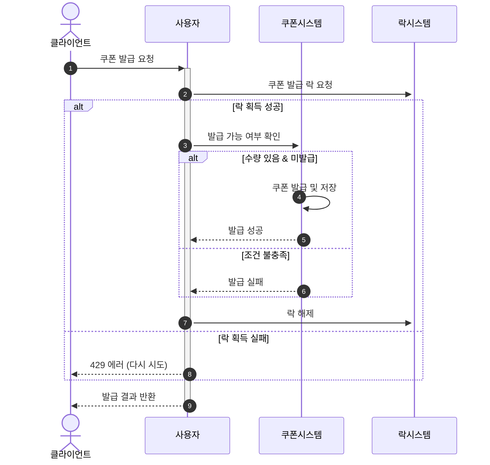
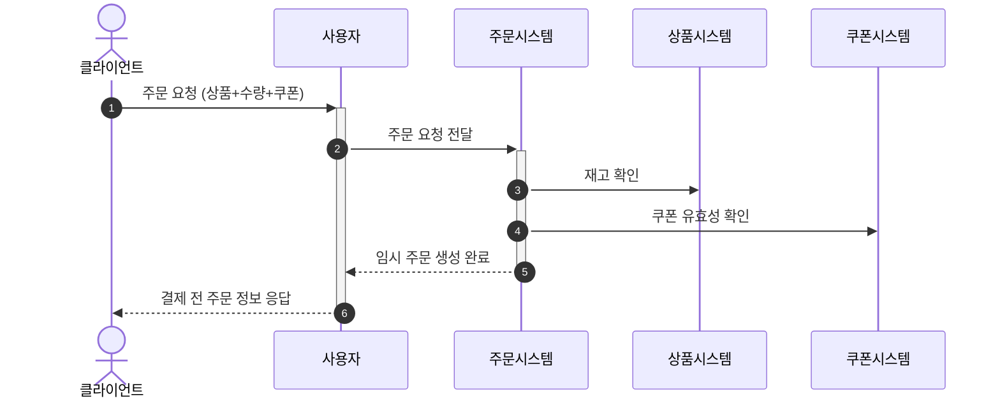
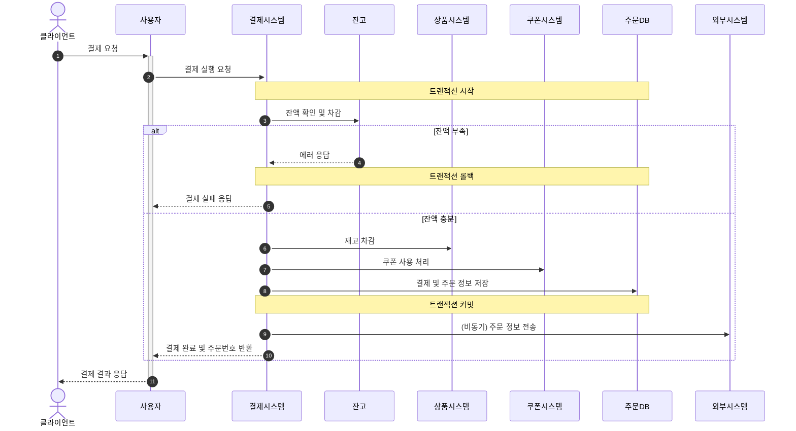
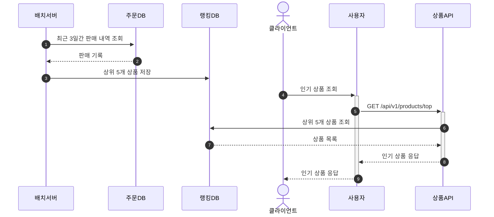

### 잔액조회

#### 설명
- **(1)** : 클라이언트가 특정 사용자에 대한 잔액 조회를 요청하며, 이 과정에서 사용자 인증을 수행한다.
- **(2)** : 사용자 서비스는 잔고 시스템에 잔액 조회를 요청한다.
- **(3)-(4)** : 잔고 시스템은 잔액 유무를 확인하여, 존재하면 해당 금액을, 존재하지 않으면 0원을 사용자 서비스에 반환한다.
- **(5)** : 사용자 서비스는 최종 결과를 클라이언트에게 응답한다.

### 잔액충전

#### 설명
- **(1)** : 클라이언트가 특정 금액을 충전하기 위해 사용자 서비스에 요청을 전달한다.
- **(2)** : 사용자 서비스는 잔고 시스템에 해당 금액이 충전 가능한지 먼저 확인한다. 이 단계에서 최대 잔액 한도 초과 여부를 검증한다.
- **(3)** : 충전 시 최대 잔액을 초과할 경우, 잔고 시스템은 에러를 반환한다.
- **(4)-(5)** : 충전이 가능한 경우, 잔고 시스템은 잔액을 생성 또는 업데이트하고, 그 내역을 충전 기록에 저장한 후 성공 결과를 반환한다.
- **(6)** : 사용자 서비스는 최종 처리 결과를 클라이언트에게 응답한다.

### 상품조회

#### 설명
- **(1)** : 클라이언트가 상품 목록 조회를 요청한다.
- **(2)** : 사용자 서비스는 페이징, 필터 등 조회 조건을 포함하여 상품 시스템에 상품 조회를 요청한다.
- **(3)** : 상품 시스템은 DB 등에서 실시간 재고를 포함한 상품 정보를 조회하는 내부 로직을 수행한다.
- **(4)-(5)** : 조회된 상품 목록을 사용자 서비스에 반환하고, 최종적으로 클라이언트에게 응답한다.

### 쿠폰발급

#### 설명
- **(1)** : 클라이언트가 선착순 쿠폰 발급을 요청한다.
- **(2)** : 사용자 서비스는 동시성 제어를 위해 락 시스템에 '락(Lock)' 획득을 먼저 요청한다.
- **(3)-(6)** : 락을 획득하면, 쿠폰 시스템에 재고 및 사용자 발급 이력을 확인하여 발급을 처리하고, 처리가 끝나면 락을 해제한다.
- **(7)** : 락 획득에 실패하면(다른 요청이 이미 처리 중), 요청이 많다는 에러를 즉시 반환한다.
- **(8)** : 사용자 서비스는 최종 발급 결과를 클라이언트에게 응답한다.

### 주문 생성 (결제 전)

#### 설명
- **(1)-(2)** : 클라이언트가 선택한 상품, 수량, 쿠폰 정보를 담아 주문을 요청하면, 사용자 서비스는 이를 주문 시스템에 전달한다.
- **(3)-(4)** : 주문 시스템은 결제를 진행하기 전, 상품 시스템을 통해 재고가 충분한지 확인하고, 쿠폰 시스템을 통해 쿠폰이 유효한지 확인한다.
- **(5)-(6)** : 모든 조건이 유효하면 결제 대기 상태의 임시 주문을 생성하고, 결제에 필요한 정보를 클라이언트에게 응답한다.

### 결제 처리

#### 설명
- **(1)-(2)** : 클라이언트가 생성된 임시 주문에 대한 결제를 요청하면, 사용자 서비스는 결제 시스템에 실행을 요청한다.
- **(3)** : 결제 시스템은 데이터 정합성을 보장하기 위해 트랜잭션을 시작하고, 가장 먼저 사용자의 잔액을 확인한다.
- **(4)** : 잔액이 부족하면 트랜잭션을 롤백하고 결제 실패를 응답한다.
- **(5)-(8)** : 잔액이 충분하면, 순차적으로 재고 차감, 쿠폰 사용 처리, 주문 정보 저장을 실행하고 트랜잭션을 커밋하여 모든 변경사항을 한 번에 확정한다.
- **(9)** : 결제가 성공하면, 데이터 분석을 위해 외부 시스템으로 주문 정보를 비동기 전송하고, 결제 완료 결과를 반환한다.
- **(10)** : 사용자 서비스는 최종 결제 결과를 클라이언트에게 응답한다.

### 상품랭킹

#### 설명
- 배치 흐름 (1)-(3)
  - 정해진 시간마다 배치 서버가 동작. 최근 3일간의 주문 데이터를 조회하여 판매량 순으로 상위 5개 상품을 집계한 후, 조회 성능을 위해 별도의 랭킹 DB(또는 캐시)에 결과를 미리 저장한다. 
- 조회 흐름 (4)-(9)
  - 클라이언트가 인기 상품 조회를 요청하면, 상품 API는 무거운 집계 쿼리를 실행하는 대신 미리 계산되어 랭킹 DB에 저장된 가벼운 데이터를 조회하여 빠르고 효율적으로 인기 상품 목록을 반환한다.