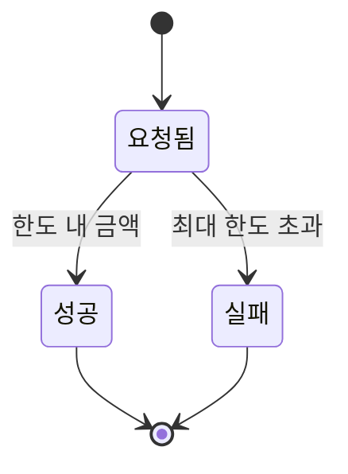
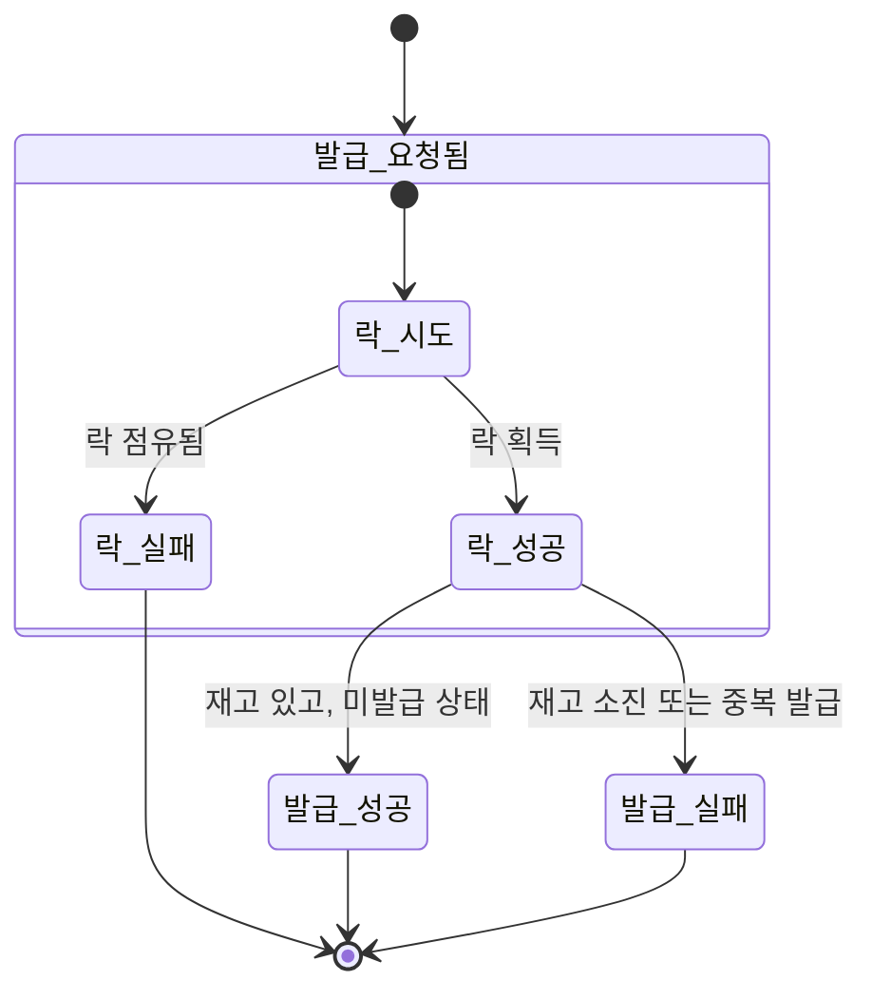
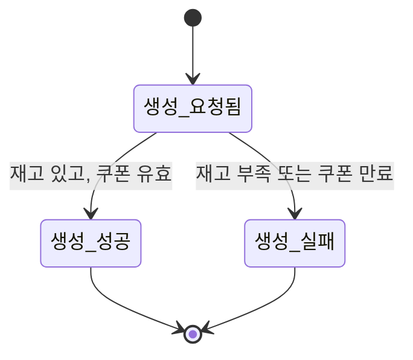
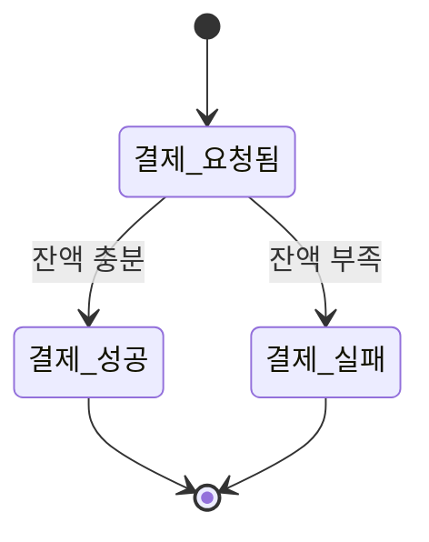

## 1. 잔액 충전 상태 다이어그램

```mermaid
stateDiagram-v2
    [*] --> 요청됨
    요청됨 --> 성공 : 한도 내 금액
    요청됨 --> 실패 : 최대 한도 초과
    성공 --> [*]
    실패 --> [*]
```

## 2. 선착순 쿠폰 발급 상태 다이어그램

```mermaid
stateDiagram-v2
    [*] --> 발급_요청됨
    state 발급_요청됨 {
        [*] --> 락_시도
        락_시도 --> 락_성공 : 락 획득
        락_시도 --> 락_실패 : 락 점유됨
    }
    락_성공 --> 발급_성공 : 재고 있고, 미발급 상태
    락_성공 --> 발급_실패 : 재고 소진 또는 중복 발급
    
    락_실패 --> [*]
    발급_성공 --> [*]
    발급_실패 --> [*]
```

## 3. 주문 생성 상태 다이어그램

```mermaid
stateDiagram-v2
    [*] --> 생성_요청됨
    생성_요청됨 --> 생성_성공 : 재고 있고, 쿠폰 유효
    생성_요청됨 --> 생성_실패 : 재고 부족 또는 쿠폰 만료
    생성_성공 --> [*]
    생성_실패 --> [*]
```

## 4. 결제 처리 상태 다이어그램

```mermaid
stateDiagram-v2
    [*] --> 결제_요청됨
    결제_요청됨 --> 결제_성공 : 잔액 충분
    결제_요청됨 --> 결제_실패 : 잔액 부족
    결제_성공 --> [*]
    결제_실패 --> [*]
```