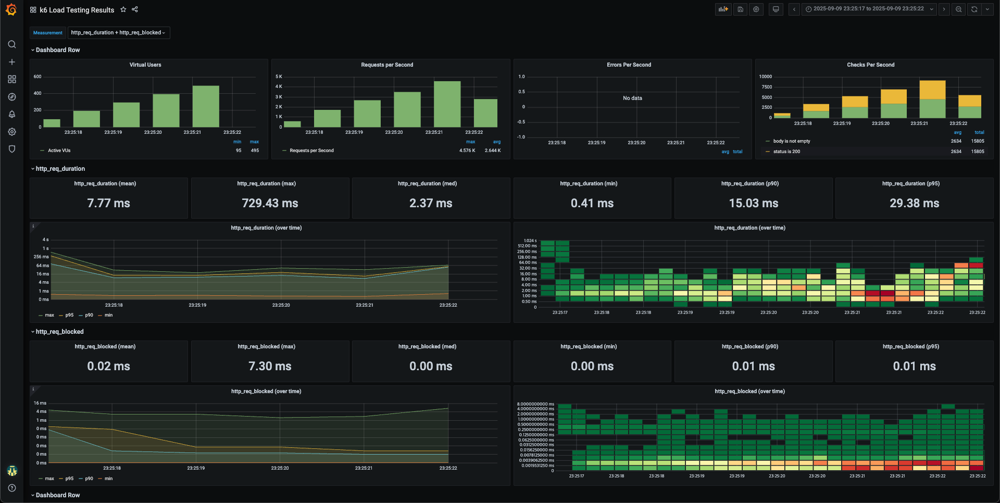

# 선착순 쿠폰 발급 부하 테스트 계획서

## 1. 테스트 개요

### 1.1 목적
- Redis + Kafka 기반 선착순 쿠폰 시스템의 대용량 트래픽 처리 능력 검증
- 동시성 제어 메커니즘의 정확성 및 성능 측정
- 시스템 병목점 식별 및 개선 방안 도출
- 실제 서비스 런칭 시 예상되는 부하에 대한 안정성 확보

### 1.2 테스트 대상
- **API Endpoint**: `POST /api/v1/coupons/issue`
- **핵심 컴포넌트**:
  - Redis Lua Script (중복 발급 검사 + 재고 관리)
  - Kafka Producer/Consumer (비동기 이벤트 처리)
  - MySQL Database (최종 쿠폰 발급 처리)

### 1.3 시스템 아키텍처
```
Client Request → CouponService → Redis 검증 → Kafka Event → DB 트랜잭션
```

## 2. 테스트 시나리오

### 2.1 기본 동시성 테스트
- **목적**: 정상적인 대용량 트래픽에서의 시스템 동작 검증
- **설정**:
  - 동시 사용자: 1,000명
  - 쿠폰 수량: 100개 (선착순)
  - 테스트 시간: 10초
  - 예상 성공률: 10% (100/1000)

```bash
 docker run -d \
  --name docker-influxdb-grafana \
  -p 3003:3003 \
  -p 3004:8083 \
  -p 8086:8086 \
  -v ./monitoring/influxdb:/var/lib/influxdb \
  -v ./monitoring/grafana:/var/lib/grafana \
  philhawthorne/docker-influxdb-grafana:latest
```

```bash
 k6 run --out influxdb=http://localhost:8086/mydb coupon-load-test.js
 ```

## 3. 성능 지표 및 측정 기준

### 3.1 핵심 성능 지표
- **응답 시간**:
  - P50 < 100ms
  - P95 < 500ms
  - P99 < 1000ms
- **처리량**: 최소 1000 RPS
- **에러율**: < 0.1% (쿠폰 소진/중복 제외)
- **정확성**: 발급된 쿠폰 수 = 설정된 수량

### 3.2 시스템 리소스 모니터링
- **CPU 사용률**: < 80%
- **메모리 사용률**: < 70%
- **Redis 연결 수**: 모니터링
- **Kafka 메시지 지연**: < 1초
- **DB 연결 풀**: 사용률 모니터링

## 4. 테스트 도구

### 4.1 부하 생성 도구
- **K6**: JavaScript 기반 부하 테스트 도구
- **기존 스크립트**: `k6-tests/coupon-load-test.js` 활용

### 4.2 모니터링 도구
- **Grafana + Prometheus**: 시스템 메트릭 모니터링
- **K6 Dashboard**: 테스트 결과 실시간 모니터링
- **Application Logs**: 에러 및 예외 상황 추적

## 4. 예상 병목점 및 대응 방안

### 5.1 예상 병목점
1. **Redis 연결 한계**: 동시 연결 수 제한
2. **Kafka Producer 지연**: 대량 메시지 전송 시 병목
3. **DB 연결 풀 고갈**: 트랜잭션 처리 지연
4. **JVM GC Pause**: 메모리 부족으로 인한 지연

## 6. 성공 기준

### 6.1 기능적 성공 기준
- ✅ 쿠폰 발급 수량 정확성 (100개 정확히 발급)
- ✅ 중복 발급 방지 (동일 사용자 1회만 발급)
- ✅ 재고 부족 시 적절한 에러 응답

### 6.2 성능적 성공 기준
- ✅ P95 응답 시간 < 500ms
- ✅ 에러율 < 0.1% (정상적인 비즈니스 에러 제외)
- ✅ 시스템 리소스 사용률 안정적 유지

