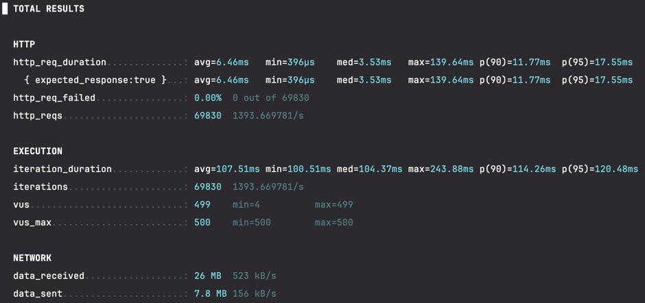

# 상품 랭킹 조회 캐싱 성능 테스트 보고서

## 1. 개요

### 테스트 목적

상품 랭킹 조회 API에 캐싱을 전/후 성능 차이를 분석하여 캐싱 효과를 검증

### 테스트 대상

- API: 상품 랭킹 조회 (Top Products)
- 스크립트: topProductsTest.js

### 테스트 환경

- **테스트 도구**: k6
- **최대 동시 사용자**: 500 VUs
- **테스트 지속 시간**: 50초 (5단계 스트레스 테스트)

## 2. 테스트 시나리오

### Stress Test 구성

- **5단계 점진적 부하 증가**
- **최대 500 VUs까지 확장**
- **총 테스트 시간**: 55초 (실행 50초 + 정리 5초)

## 3. 테스트 결과

- 인기 상품 조회는 추후에 날짜 별로 검색할 필요가 있다고 생각하여 상품 조회 시 파라미터로 날짜(선택 / 기본 값 : 금일)를 받아서 조회하도록 구현하였습니다.
- 성능 테스트를 하기 위해 더미데이터 프로시저를 사용하여 최근 5일간에 2만개의 데이터를 추가하여 성능 테스트를 하였습니다.
- 성능 테스트를 한 결과 아래와 같습니다.

### 3.1 캐시 미적용 시 (첫 번째 테스트)

| 지표                  | 값           |
|---------------------|-------------|
| **총 요청 수**          | 47,616건     |
| **요청 처리율**          | 946.1 req/s |
| **HTTP 실패율**        | 0.00%       |
| **평균 응답시간**         | 58.65ms     |
| **중간값 응답시간**        | 32.16ms     |
| **최소 응답시간**         | 1.35ms      |
| **최대 응답시간**         | 419.59ms    |
| **90th percentile** | 167.62ms    |
| **95th percentile** | 219.57ms    |
| **평균 반복 시간**        | 158.89ms    |

### 3.2 캐시 적용 시 (두 번째 테스트)

| 지표                  | 값             |
|---------------------|---------------|
| **총 요청 수**          | 69,830건       |
| **요청 처리율**          | 1,393.7 req/s |
| **HTTP 실패율**        | 0.00%         |
| **평균 응답시간**         | 6.46ms        |
| **중간값 응답시간**        | 3.53ms        |
| **최소 응답시간**         | 396µs         |
| **최대 응답시간**         | 139.64ms      |
| **90th percentile** | 11.77ms       |
| **95th percentile** | 17.55ms       |
| **평균 반복 시간**        | 107.51ms      |

## 4. 성능 비교 분석

### 4.1 응답시간 개선효과

| 응답시간 지표             | 캐시 적용 전  | 캐시 적용 후  | 개선율          |
|---------------------|----------|----------|--------------|
| **평균 응답시간**         | 58.65ms  | 6.46ms   | **88.9% 개선** |
| **중간값 응답시간**        | 32.16ms  | 3.53ms   | **89.0% 개선** |
| **90th percentile** | 167.62ms | 11.77ms  | **92.9% 개선** |
| **95th percentile** | 219.57ms | 17.55ms  | **92.0% 개선** |
| **최대 응답시간**         | 419.59ms | 139.64ms | **66.7% 개선** |

### 4.2 처리량 (Throughput) 개선효과

| 처리량 지표        | 캐시 적용 전     | 캐시 적용 후       | 개선율          |
|---------------|-------------|---------------|--------------|
| **요청 처리율**    | 946.1 req/s | 1,393.7 req/s | **47.3% 증가** |
| **총 처리 요청 수** | 47,616건     | 69,830건       | **46.6% 증가** |
| **평균 반복 시간**  | 158.89ms    | 107.51ms      | **32.3% 개선** |

### 4.3 주요 개선 포인트

**응답시간 대폭 개선**

- 평균 응답시간 **88.9% 개선** (58.65ms -> 6.46ms)
- 중간값 응답시간 **89.0% 개선** (32.16ms -> 3.53ms)
- 95th percentile **92.0% 개선** (219.57ms -> 17.55ms)

> 95th percentile란? 
> 전체 요청 중 95%가 해당 시간 이내에 완료된 것 
>
> - **캐시 미적용 시: 95th percentile = 219.57ms** 
>   - 100번의 요청 중 95번은 219.57ms 이내에 완료 
>   - 나머지 5번만 219.57ms보다 오래 걸림
>  
> - **캐시 적용 시: 95th percentile = 17.55ms**
>   - 100번의 요청 중 95번은 17.55ms 이내에 완료  
>   - 나머지 5번만 17.55ms보다 오래 걸림 

**처리량 대폭 향상**

- 초당 요청 처리량 **47.3% 증가** (946.1 req/s -> 1,393.7 req/s)
- 동일한 시간 동안 **46.6% 더 많은 요청 처리**

**시스템 안정성 향상**

- 최대 응답시간 **66.7% 개선** (419.59ms -> 139.64ms)
- 응답시간 편차 현저히 감소로 **예측 가능한 성능** 제공

**사용자 경험 개선**

- 체감 응답속도를 나타내는 중간값이 **10배 이상 빨라짐**
- 느린 요청의 비율 대폭 감소 (95th percentile 기준)

## 5. 네트워크 사용량

### 5.1 데이터 전송량 비교

| 구분         | 캐시 미적용           | 캐시 적용            | 차이   |
|------------|------------------|------------------|------|
| **수신 데이터** | 20MB (393 kB/s)  | 26MB (523 kB/s)  | +30% |
| **송신 데이터** | 5.3MB (106 kB/s) | 7.8MB (156 kB/s) | +47% |

### 5.2 네트워크 효율성 분석

- **요청당 평균 수신 데이터**
    - 캐시 미적용: 431 bytes/req
    - 캐시 적용: 382 bytes/req
    - **11.4% 효율성 향상**

- **더 많은 총 데이터 처리량**: 캐시 적용으로 더 많은 요청을 처리하여 전체 데이터 전송량 증가
- **단위 요청당 효율성**: 캐시를 통한 데이터 압축 및 최적화 효과

## 6. 결론 및 권장사항

### 6.1 캐싱 효과 검증

✅ **캐싱 적용으로 상품 랭킹 조회 API의 성능이 대폭 개선**

**핵심 성과:**

- **응답시간 88.9% 개선** (58.65ms -> 6.46ms)
- **처리량 47.3% 증가** (946.1 req/s -> 1,393.7)
- **95th percentile 92.0% 개선** (219.57ms -> 17.55ms)
- **시스템 안정성 대폭 향상**

### 6.2 비즈니스 임팩트

**예상 사용자 경험**

- 체감 응답속도 **10배 이상 향상** (중간값 기준)
- 느린 응답의 발생 빈도 **90% 이상 감소**
- 일관된 빠른 서비스 제공으로 사용자 만족도 극대화

**시스템 효율성**

- **47% 더 많은 요청 처리** 능력 확보
- 동일한 인프라로 **더 많은 트래픽 수용** 가능
- 서버 리소스 사용률 최적화

**운영 안정성**

- 최대 응답시간 66.7% 단축으로 **타임아웃 위험 감소**

### 6.3 권장사항

**모니터링 강화**

- 캐시 히트율, 만료 정책 최적화를 위한 **실시간 모니터링** 구축
- 성능 지표 추적을 통한 **지속적 최적화**