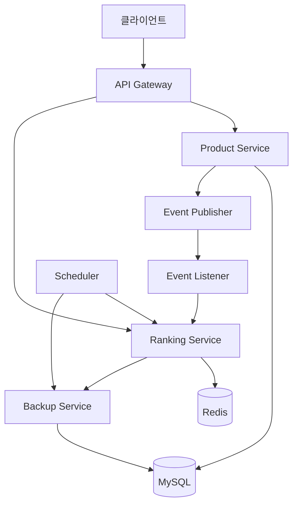

# 실시간 랭킹 시스템 및 비동기 처리 설계/개발 회고 보고서

## 📋 목차

1. [시스템 설계](#시스템-설계)
2. [핵심 설계 원칙](#핵심-설계-원칙)
3. [구현 과정](#구현-과정)

## 시스템 설계

### 전체 아키텍처



### 핵심 설계 원칙

#### 1. 이벤트 기반 아키텍처

```kotlin
@Service
class ProductService() {
    @Transactional
    fun deductStock(productId: Long, quantity: Int) {
        val product = productRepository.findByIdWithPessimisticLock(productId)
        val previousStock = product.stock

        product.deductStock(quantity)
        val updatedProduct = productRepository.save(product)

        // 재고 변경 시 이벤트 발행
        applicationEventPublisher.publishEvent(
            StockChangedEvent(
                productId = productId,
                changeType = StockChangeType.DEDUCT,
                changeQuantity = quantity,
                previousStock = previousStock,
                currentStock = updatedProduct.stock,
                reason = StockChangeType.DEDUCT.reason
            )
        )
    }
}
```

### 2. 계층형 아키텍처 (Clean Architecture)

```
├── presentation/     # Controller Layer
├── application/      # Service Layer  
├── domain/          # Domain Layer
└── infrastructure/  # Infrastructure Layer
    ├── persistence/
    ├── scheduler/
    └── event/
```

## 구현 과정

### 1단계: 도메인 모델링

#### 랭킹 데이터 구조 설계

```kotlin
data class ProductRankingCache(
    val productId: Long,
    val totalSalesCount: Int
)

enum class StockChangeType(
    val reason: String,
    val affectsRanking: Boolean = false
) {
    DEDUCT("상품 주문으로 인한 재고 차감", affectsRanking = true),
    RESTORE("주문 취소로 인한 재고 복원", affectsRanking = false)
}
```

### 2단계: Redis 기반 랭킹 시스템 구현

#### Redisson Sorted Set 활용
```kotlin
@Repository
class ProductRedissonRepositoryImpl(
    private val redissonClient: RedissonClient,
) : ProductRedissonRepository {

    override fun increaseScore(productId: Long, quantity: Int) {
        val today = LocalDate.now()
        val score = quantity.toDouble()

        // 일간 랭킹 업데이트
        val dailyKey = PRODUCT_RANKING_DAILY.format(today.format(DAILY_FORMAT))
        updateScoreForKey(dailyKey, productId.toString(), score)

        // 주간 랭킹 업데이트
        val weekFields = WeekFields.of(Locale.getDefault())
        val weeklyDate = today.with(weekFields.dayOfWeek(), 1)
        val weeklyKey = PRODUCT_RANKING_WEEKLY.format(weeklyDate.format(WEEKLY_FORMAT))
        updateScoreForKey(weeklyKey, productId.toString(), score)
    }

    // Score 업데이트 하는 메서드
    private fun updateScoreForKey(key: String, member: String, score: Double) {
        val sortedSet = redissonClient.getScoredSortedSet<String>(key)

        sortedSet.addScore(member, score)
    }
}
```

#### 핵심 설계 결정사항
1. **키 구성 전략**: `product:ranking:daily:2025-08-22`, `product:ranking:weekly:2024-W18` 
2. **점수 누적**: `addScore()` 메서드로 기존 점수에 누적
3. **정렬 방식**: `entryRangeReversed()`로 `Score` 내림차순 정렬

### 3단계: 이벤트 기반 비동기 처리

#### 이벤트 리스너 구현
```kotlin
@Component
class ProductStockEventListener(
    private val productStockHistoryRepository: ProductStockHistoryRepository,
    private val productRankingService: ProductRankingService
) {

    @TransactionalEventListener(phase = TransactionPhase.AFTER_COMMIT)
    fun handleStockChanged(event: StockChangedEvent) {
        val history = ProductStockHistory(
            productId = event.productId,
            changeType = event.changeType,
            changeQuantity = event.changeQuantity,
            previousStock = event.previousStock,
            currentStock = event.currentStock,
            reason = event.reason
        )

        productService.saveProductStockHistory(history)

        when (event.changeType) {
            StockChangeType.DEDUCT -> productRankingService.increaseProductStockCache(
                event.productId,
                event.changeQuantity
            )

            else -> {
                // 재고 복원 등에 대한 코드
            }
        }
    }
}
```

#### 비동기 처리의 이점
- 메인 로직과 랭킹 업데이트 분리
- 랭킹 시스템 장애가 주문 프로세스에 영향 없음
- 이벤트 기반으로 새로운 기능 추가 용이

#### 스케줄러 기반 자동 백업
```kotlin
@Component
class ProductRankingScheduler(
    private val productRankingService: ProductRankingService
) {
    
    @Scheduled(cron = "0 0 2 * * *") // 매일 새벽 2시
    fun initializeDailyRanking() {
        val today = LocalDate.now()
        val yesterday = today.minusDays(1)

        productRankingService.backupDailyRanking(yesterday)

        productRankingService.cleanupDailyRanking(yesterday)
    }

    @Scheduled(cron = "0 0 3 * * MON") // 매주 새벽 3시
    fun initializeWeeklyRanking() {
        val today = LocalDate.now()
        val yesterday = today.minusDays(1)

        productRankingService.cleanupWeeklyRanking(yesterday)
    }
}
```
- 일간 인기 상품 : 매일 새벽 2시에 Redis에 있는 작일 상품 랭킹 데이터를 DB에 저장 및 Redis 데이터 삭제
- 주간 인기 상품 : 매주 새벽 3시에 Redis에 있는 작주 상품 랭킹 데이터를 DB에 저장 및 Redis 데이터 삭제