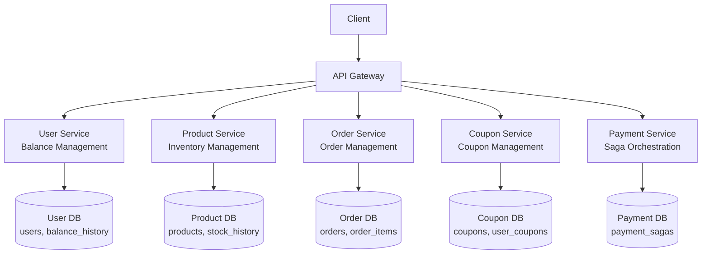
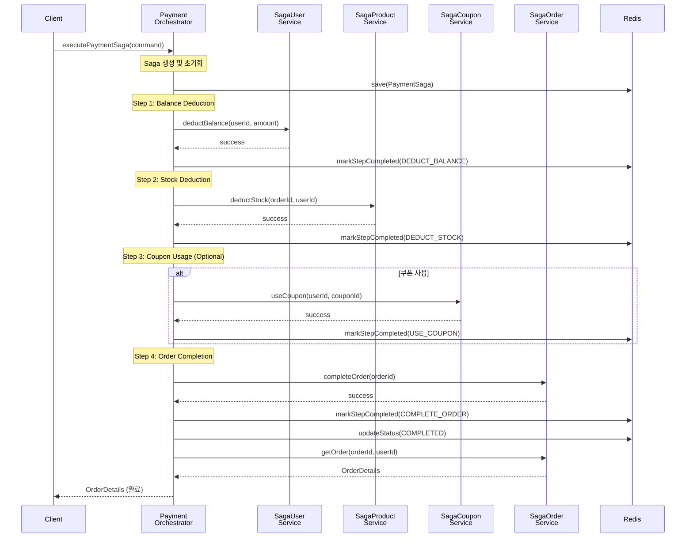
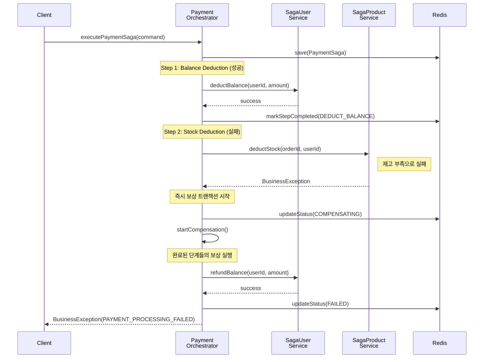
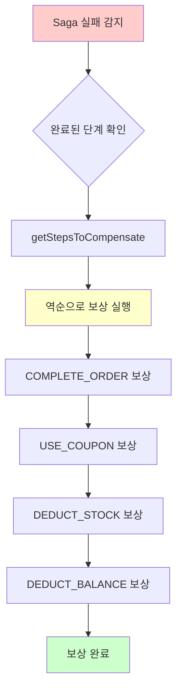
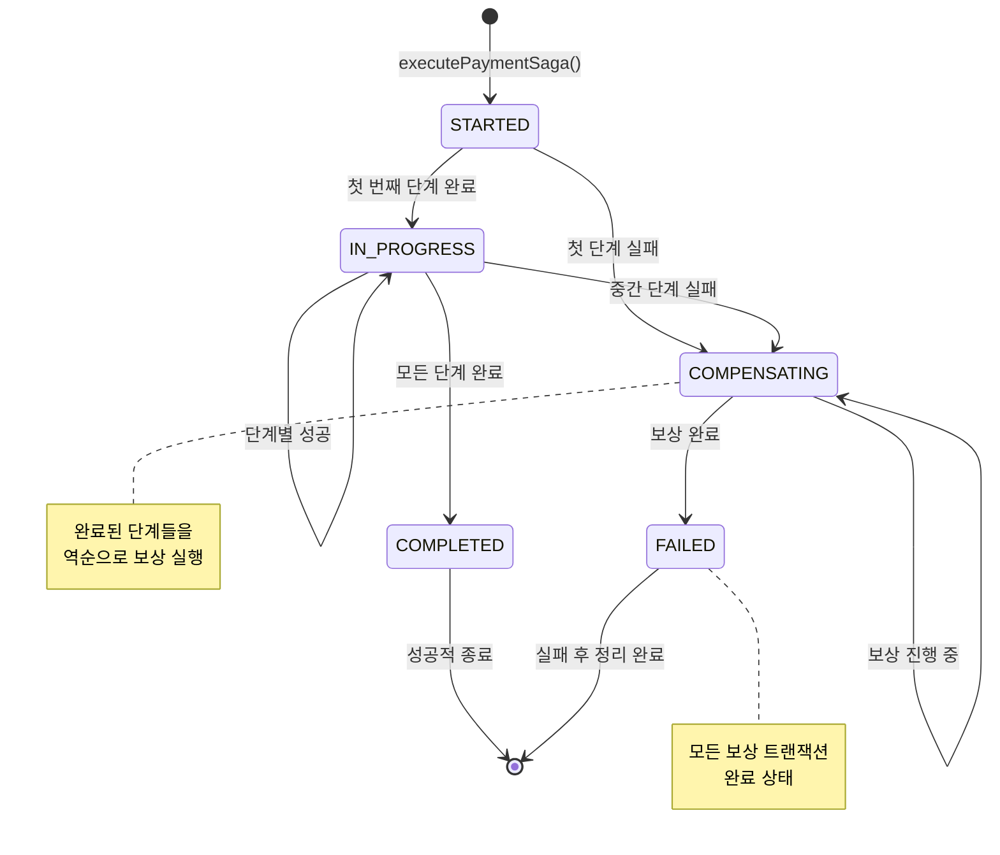

# MSA 분산 트랜잭션 설계 문서

## 1. 개요

### 1.1 목적

모놀리식 아키텍처에서 MSA로 전환 시 발생하는 분산 트랜잭션 문제를 파악, 순수 Orchestration Saga 패턴을 통한 해결 방안 설계 문서

### 1.2 현재 시스템 구성

- **아키텍처**: Spring Boot 모놀리식
- **데이터베이스**: 단일 MySQL 인스턴스
- **분산처리**: 순수 Orchestration Saga 패턴 적용 완료

---

## 2. MSA 전환 시 트랜잭션 문제 진단

### 2.1 현재 모놀리식 구조의 한계

#### 2.1.1 단일 트랜잭션의 문제점

```kotlin
// 현재: 단일 트랜잭션으로 모든 도메인 처리
@Transactional
fun processOrder(request: OrderCreateCommand): OrderDetails {
    val calculatedDetails = calculateOrderAmounts(request)      // Product, Coupon 도메인 접근
    val order = Order.create(userId, originalAmount, ...)       // Order 도메인
    val savedOrder = orderRepository.save(order)               // DB 저장
    val orderItems = createOrderItems(request, ...)            // OrderItem 생성
    val savedOrderItems = orderItemRepository.saveAll(orderItems) // DB 저장
    return OrderDetails.from(savedOrder, savedOrderItems)
}
```

**문제점**

- 하나의 트랜잭션에서 여러 도메인 간 매우 강결합 되어 있음
- 트랜잭션 범위가 넓어 락 시간 증가
- 부분 실패 시 전체 롤백
- MSA 분리 시 분산 트랜잭션 불가피

### 2.2 MSA 전환 후 예상 문제

#### 2.2.1 서비스 분리 구조



#### 2.2.2 분산 환경에서의 ACID 한계

**Atomicity (원자성) 문제**

```kotlin
// MSA 환경에서 불가능한 시나리오
fun processPayment() {
    userService.deductBalance(userId, amount)      // User DB
    productService.deductStock(productId, quality)     // Product DB  
    orderService.completeOrder(orderId)            // Order DB
    couponService.useCoupon(couponId)              // Coupon DB
    // 부분 성공 가능성 존재 - 원자성 보장 불가
}
```

**Consistency (일관성) 문제**

- 서비스 간 참조 무결성 보장 어려움

**Isolation (격리성) 문제**

- 서비스 간 동시성 제어 복잡
- 분산 락 메커니즘 필요

**Durability (지속성) 문제**

- 네트워크 분할 시 데이터 손실 위험
- 서비스별 장애 복구 시점 차이

---

## 3. 순수 Orchestration Saga 패턴 설계

### 3.1 Saga 패턴 선택 근거

#### 3.1.1 2PC vs Saga 패턴 비교

| 구분      | 2PC (Two-Phase Commit) | Saga 패턴               |
|---------|------------------------|-----------------------|
| **성능**  | 느림 (모든 참여자 대기)         | 빠름 (비동기 처리)           |
| **가용성** | 낮음 (단일 장애점)            | 높음 (장애 격리)            |
| **확장성** | 제한적                    | 우수                    |
| **복잡성** | 낮음                     | 높음 (보상 로직)            |
| **일관성** | Strong Consistency     | Eventually Consistent |

#### 3.1.2 Orchestration vs Choreography

**순수 Orchestration 패턴 선택 이유**

- 중앙 집중식 제어로 복잡한 비즈니스 플로우 관리 용이
- 동기식 실행으로 트랜잭션 상태 추적 및 모니터링 단순화
- 즉시 보상 트랜잭션으로 빠른 장애 복구
- 디버깅 및 장애 추적 용이
- MSA 전환 시 서비스 호출만 변경하면 되는 구조

### 3.2 현재 구현된 Saga 구조

#### 3.2.1 PaymentSagaOrchestrator 아키텍처

```kotlin
@Service
class PaymentSagaOrchestrator(
    private val sagaRepository: PaymentSagaRepository,
    private val sagaOrderService: SagaOrderService,
    private val sagaUserService: SagaUserService,
    private val sagaProductService: SagaProductService,
    private val sagaCouponService: SagaCouponService,
) {
    // 중앙 오케스트레이터가 모든 단계를 동기식으로 제어
    @Transactional
    fun executePaymentSaga(command: PaymentProcessCommand): OrderDto.OrderDetails {
        // Step 1: 잔액 차감
        sagaUserService.deductBalance(saga.userId, saga.finalAmount)
        
        // Step 2: 재고 차감  
        sagaProductService.deductStock(saga.orderId, saga.userId)
        
        // Step 3: 쿠폰 사용 (선택적)
        if (saga.userCouponId != null) {
            sagaCouponService.useCoupon(saga.userId, saga.userCouponId)
        }
        
        // Step 4: 주문 완료
        sagaOrderService.completeOrder(saga.orderId)
        
        // 실패 시 즉시 보상 트랜잭션 실행
    }

    // 보상 트랜잭션 즉시 실행
    private fun startCompensation(saga: PaymentSaga)
    private fun executeCompensation(saga: PaymentSaga, step: PaymentSagaStep)
}
```

#### 3.2.2 MSA 준비를 위한 서비스 인터페이스 분리

```kotlin
// MSA 전환을 위한 인터페이스 추상화
interface SagaUserService {
    fun deductBalance(userId: Long, amount: Int)
    fun refundBalance(userId: Long, amount: Int)
}

interface SagaProductService {
    fun deductStock(orderId: Long, userId: Long)
    fun restoreStock(orderId: Long, userId: Long)
}

interface SagaCouponService {
    fun useCoupon(userId: Long, userCouponId: Long)
    fun restoreCoupon(userId: Long, userCouponId: Long)
}

interface SagaOrderService {
    fun getOrderForPayment(orderId: Long, userId: Long): OrderDto.OrderDetails
    fun completeOrder(orderId: Long)
    fun cancelOrder(orderId: Long)
    fun getOrder(orderId: Long, userId: Long): OrderDto.OrderDetails
}

// 현재 모놀리식 구현체 (추후 REST 클라이언트로 교체)
@Service
class SagaUserServiceImpl(private val balanceService: BalanceService) : SagaUserService
```

---

## 4. Saga 패턴 시퀀스 다이어그램

### 4.1 정상 플로우



### 4.2 실패 플로우



---

## 5. 보상 트랜잭션 설계

### 5.1 보상 트랜잭션 매핑

#### 5.1.1 Forward Transaction vs Compensation Transaction

| Saga Step          | Forward Transaction            | Compensation Transaction        |
|--------------------|--------------------------------|---------------------------------|
| **DEDUCT_BALANCE** | `balanceService.use()`         | `balanceService.charge()`       |
| **DEDUCT_STOCK**   | `productService.deductStock()` | `productService.restoreStock()` |
| **USE_COUPON**     | `couponService.useCoupon()`    | `couponService.restoreCoupon()` |
| **COMPLETE_ORDER** | `orderService.completeOrder()` | `orderService.cancelOrder()`    |

#### 5.1.2 보상 트랜잭션 실행 순서



### 5.2 보상 트랜잭션 구현

#### 5.2.1 PaymentSaga 도메인 모델

```kotlin
class PaymentSaga {
    // 완료된 단계 추적
    val completedSteps: MutableList<PaymentSagaStep> = mutableListOf()

    // 보상 완료된 단계 추적  
    val compensatedSteps: MutableList<PaymentSagaStep> = mutableListOf()

    // 보상이 필요한 단계들을 역순으로 반환
    fun getStepsToCompensate(): List<PaymentSagaStep> {
        return completedSteps.filter { !compensatedSteps.contains(it) }.reversed()
    }
}
```

#### 5.2.2 직접 보상 로직 실행

```kotlin
private fun executeCompensation(saga: PaymentSaga, step: PaymentSagaStep) {
    when (step) {
        PaymentSagaStep.DEDUCT_BALANCE -> {
            log.info("잔액 환불 실행 - sagaId: {}, amount: {}", saga.sagaId, saga.finalAmount)
            sagaUserService.refundBalance(saga.userId, saga.finalAmount)
        }

        PaymentSagaStep.DEDUCT_STOCK -> {
            log.info("재고 복구 실행 - sagaId: {}, orderId: {}", saga.sagaId, saga.orderId)
            sagaProductService.restoreStock(saga.orderId, saga.userId)
        }

        PaymentSagaStep.USE_COUPON -> {
            saga.userCouponId?.let { couponId ->
                log.info("쿠폰 복구 실행 - sagaId: {}, couponId: {}", saga.sagaId, couponId)
                sagaCouponService.restoreCoupon(saga.userId, couponId)
            }
        }

        PaymentSagaStep.COMPLETE_ORDER -> {
            log.info("주문 취소 실행 - sagaId: {}, orderId: {}", saga.sagaId, saga.orderId)
            sagaOrderService.cancelOrder(saga.orderId)
        }

        PaymentSagaStep.CREATE_ORDER -> {}
    }
}

// 보상 트랜잭션 시작
private fun startCompensation(saga: PaymentSaga) {
    log.info("Saga 보상 트랜잭션 시작 - sagaId: {}", saga.sagaId)

    val stepsToCompensate = saga.getStepsToCompensate()

    for (step in stepsToCompensate) {
        try {
            executeCompensation(saga, step)
            log.info("보상 트랜잭션 완료 - sagaId: {}, step: {}", saga.sagaId, step)
        } catch (e: Exception) {
            log.error(
                "보상 트랜잭션 실패 - sagaId: {}, step: {}, reason: {}",
                saga.sagaId, step, e.message, e
            )
        }
    }
}
```

### 5.3 보상 트랜잭션 상태 다이어그램



---

## 6. MSA 환경에서의 고려사항

### 6.1 서비스 간 통신

#### 6.1.1 동기 vs 비동기 선택 기준

동기 통신 (REST API)
  - 즉시 응답이 필요한 조회 작업
  - 사용자 인터랙션이 필요한 경우
  - 예: 잔액 조회, 상품 정보 조회

비동기 통신 (Event)
  - 시간이 오래 걸리는 작업
  - 다른 서비스에 영향을 주지 않아야 하는 작업
  - 예: 재고 차감, 알림 발송, 통계 업데이트

#### 6.1.2 메시지 큐 설계(극히 예시)

```yaml
# Kafka Topic 구성
topics:
  - name: payment-saga-events
    partitions: 3
    replication-factor: 3
    events:
      - PaymentSagaStartedEvent
      - BalanceDeductionRequestedEvent
      - StockDeductionRequestedEvent
      - CouponUsageRequestedEvent
      - OrderCompletionRequestedEvent

  - name: saga-compensation-events
    partitions: 3
    replication-factor: 3
    events:
      - BalanceRefundRequestedEvent
      - StockRestoreRequestedEvent
      - CouponRestoreRequestedEvent
      - OrderCancellationRequestedEvent
```

### 6.2 데이터 일관성 보장

#### 6.2.1 Outbox 패턴 적용

```kotlin
// 서비스별 Outbox 테이블
@Entity
class OutboxEvent(
    val aggregateId: String,        // 연관된 엔티티 ID
    val eventType: String,          // 이벤트 타입
    val eventData: String,          // 이벤트 데이터 (JSON)
    val createdAt: LocalDateTime,   // 생성 시간
    var processed: Boolean = false  // 처리 여부
)

// 트랜잭션과 함께 Outbox 저장
@Transactional
fun deductStock(productId: Long, quantity: Int) {
    val product = productRepository.findByIdWithLock(productId)
    product.deductStock(quantity)
    productRepository.save(product)

    // 같은 트랜잭션에서 Outbox 저장
    val event = StockDeductedEvent(productId, quantity)
    outboxRepository.save(OutboxEvent.from(event))
}
```

#### 6.2.2 이벤트 소싱 도입 검토

```kotlin
// 이벤트 기반 상태 복원
@EventSourced
class PaymentSagaAggregate {
    private var state: PaymentSagaState = PaymentSagaState.initial()

    fun handle(command: StartPaymentCommand): List<DomainEvent> {
        return listOf(
            PaymentSagaStartedEvent(command.sagaId, command.orderId),
            BalanceDeductionRequestedEvent(command.userId, command.amount)
        )
    }

    fun on(event: BalanceDeductedEvent) {
        state = state.markStepCompleted(PaymentSagaStep.DEDUCT_BALANCE)
    }
}
```

### 6.3 장애 처리 및 복구

#### 6.3.1 타임아웃 및 재시도 전략

```kotlin
// Spring Retry 적용
class Example {
    @Retryable(
        value = [Exception::class],
        maxAttempts = 3,
        backoff = @Backoff(delay = 1000, multiplier = 2.0)
    )
    @EventListener
    fun handleBalanceDeductionRequested(event: BalanceDeductionRequestedEvent) {
        try {
            val command = BalanceDeductCommand(event.userId, event.amount)
            balanceService.use(command)

            applicationEventPublisher.publishEvent(
                BalanceDeductedEvent(event.sagaId, event.orderId, event.userId, event.amount)
            )
        } catch (e: Exception) {
            log.error("잔액 차감 실패 - sagaId: {}", event.sagaId, e)

            applicationEventPublisher.publishEvent(
                BalanceDeductionFailedEvent(event.sagaId, event.orderId, event.userId, event.amount, e.message)
            )
        }
    }
}

class KafkaExample {
    // 최종 실패 시 Dead Letter Queue 처리
    @RabbitListener(queues = ["payment-saga-dlq"])
    fun handleFailedEvent(event: SagaEvent) {
        // 수동 처리를 위한 알림 발송
        alertService.sendAlert("Saga 처리 최종 실패", event)
    }
}
```

#### 6.3.2 Circuit Breaker 패턴

```kotlin
@Component
class UserServiceClient {

    @CircuitBreaker(name = "user-service", fallbackMethod = "fallbackGetUserBalance")
    @TimeLimiter(name = "user-service")
    @Retry(name = "user-service")
    fun getUserBalance(userId: Long): CompletableFuture<BalanceResponse> {
        return CompletableFuture.supplyAsync {
            restTemplate.getForObject("/users/$userId/balance", BalanceResponse::class.java)
        }
    }

    fun fallbackGetUserBalance(userId: Long, ex: Exception): CompletableFuture<BalanceResponse> {
        log.warn("User Service 호출 실패, 캐시에서 조회: {}", ex.message)
        return CompletableFuture.completedFuture(
            cacheService.getCachedBalance(userId) ?: BalanceResponse.empty()
        )
    }
}
```

---

## 7. 결론 및 개선 방향

### 7.1 현재 구현의 장점

1. **순수 Orchestration 패턴**: 중앙 집중식 제어로 복잡한 비즈니스 플로우 관리
2. **MSA 준비 인터페이스 분리**: 서비스 레이어 인터페이스로 MSA 전환 준비 완료
3. **동기식 실행**: 단계별 순차 실행으로 디버깅 및 상태 추적 용이
4. **즉시 보상 트랜잭션**: 실패 시 즉시 보상 실행으로 빠른 장애 복구
5. **Redis 기반 상태 관리**: 빠른 상태 조회 및 TTL 기반 자동 정리

### 7.2 개선 방향
1. **타임아웃 처리**: 장기 실행 Saga 자동 종료 메커니즘
2. **재시도 전략**: 실패한 단계의 자동 재시도 로직
3. **멱등성 보장**: 중복 이벤트 처리 방지
4. **Outbox 패턴**: 메시지 발행과 DB 저장의 트랜잭션 일관성
5. **Circuit Breaker**: 서비스 간 장애 전파 방지
6. **Dead Letter Queue**: 최종 실패 이벤트 처리

### 7.3 개선 이후 방향
1. **분산 추적**: Zipkin/Jaeger를 통한 Saga 플로우 추적
2. **이벤트 소싱**: 이벤트 기반 상태 복원
3. **CQRS 패턴**: 명령과 조회의 분리
4. **Database per Service**: 완전한 서비스별 DB 분리
5. **Kubernetes 기반 배포**: 컨테이너 오케스트레이션