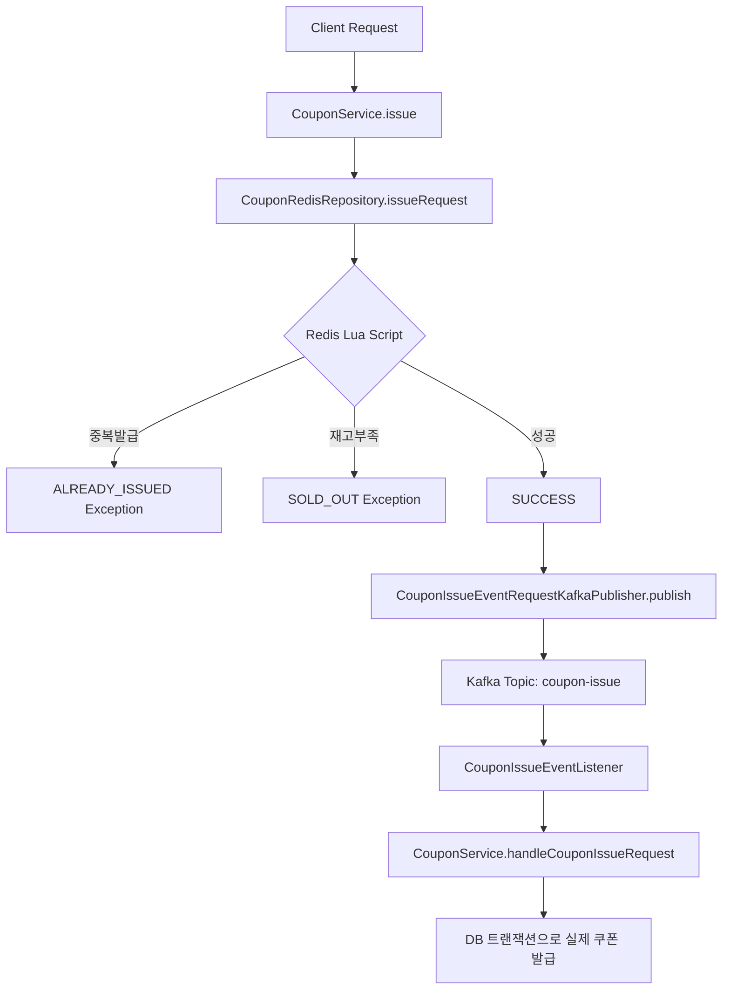

# 09. Kafka 기반 쿠폰 시스템 설계 문서

## 1. 시스템 아키텍처

## 2. 핵심 컴포넌트

### 2.1 Redis 빠른 검증
- **중복 발급 검사**: Set 자료구조로 사용자별 발급 이력 관리
- **재고 관리**: 원자적 DECR 연산으로 동시성 제어
- **Lua Script**: 모든 검증 로직을 원자적으로 실행

### 2.2 Kafka 비동기 처리
- **Topic**: `coupon-issue` (3 partitions, 3 replicas)
- **Consumer Group**: `coupon_issue` (concurrency: 3)
- **이벤트**: `CouponIssueEvent(userId, couponId, issuedAt)`

### 2.3 DB 최종 검증 및 발급
- 트랜잭션 내에서 재검증 후 실제 쿠폰 발급
- 쿠폰 발급 수량 증가 + 사용자 쿠폰 생성

## 3. 동작 프로세스

### 3.1 정상 시나리오
1. 사용자 요청 → Redis 검증 (중복/재고) → 즉시 응답
2. Kafka 이벤트 발행 → Consumer 처리 → DB 실제 발급

### 3.2 예외 시나리오  
- **중복 발급**: Redis Set에서 즉시 차단
- **재고 부족**: Redis에서 즉시 차단
- **Consumer 실패**: Kafka 재시도 메커니즘

## 4. 기술 특징

- **응답 속도**: Redis 기반 수 ms 응답
- **신뢰성**: Kafka 메시지 영속성 + 2단계 검증
- **확장성**: Consumer 인스턴스 추가로 처리량 증가
- **동시성**: Redis Lua Script로 원자적 처리